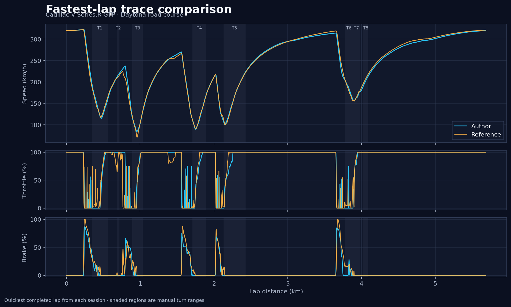
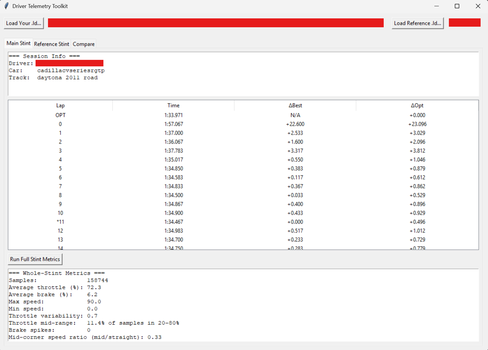
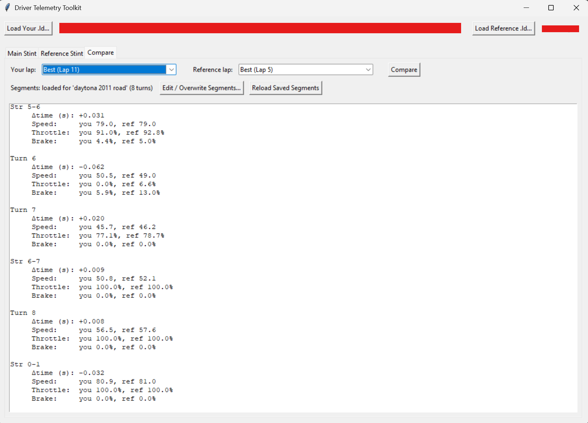
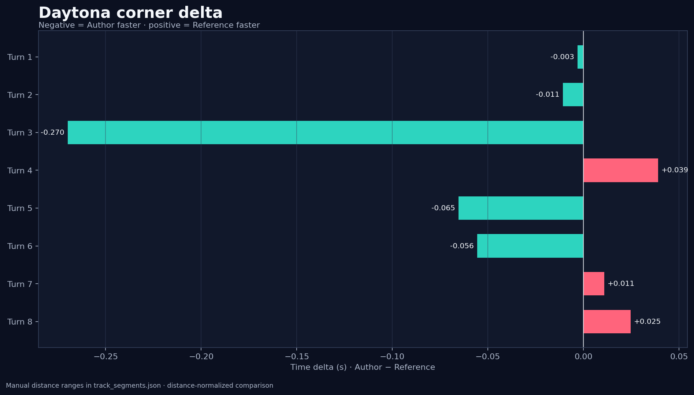
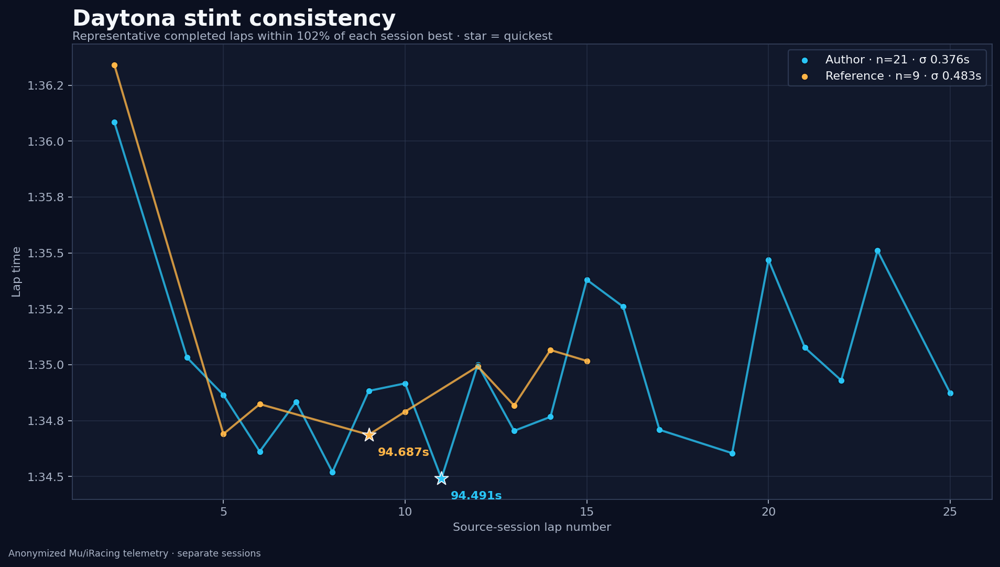

# Driver Telemetry Toolkit

[](https://github.com/pothamsettivarun/driver-telemetry-toolkit/actions/workflows/tests.yml)
[](LICENSE.txt)

A Python analysis tool for turning Mu-exported MoTeC `.ld` telemetry into lap-consistency metrics and distance-aligned driver comparisons.



## Engineering problem

Raw telemetry makes it easy to see that two laps differ, but harder to identify **where** the time moved and which driver inputs changed. This toolkit:

- detects completed laps while rejecting partial out-laps and final fragments;
- uses iRacing's reported best-lap channels when available;
- summarizes whole-stint pace and consistency;
- aligns two laps by normalized distance;
- reports time, speed, throttle, and brake differences through manual track segments; and
- offers both a terminal workflow and a Tkinter desktop GUI.

## Desktop interface

The GUI supports full-stint review, reference-lap selection, saved track segmentation, and segment-by-segment comparison. These screenshots show a separate full-session demonstration; the reproducible Daytona example below uses the anonymized sample files. Driver names and local file paths are intentionally redacted. Click either image for the full-resolution view.

<p align="center">
  <a href="docs/images/gui-stint-overview.png"></a>
  <a href="docs/images/gui-lap-comparison.png"></a>
</p>

<p align="center"><sub>Whole-stint summary (left) · lap-comparison output (right)</sub></p>

## Daytona example

The checked-in case study compares the quickest completed lap from two Cadillac V-Series.R GTP sessions at the Daytona road course. The car, track, and setup were the same; the sessions and conditions were not identical.

| Sample | Source lap | Official lap time | Difference |
|---|---:|---:|---:|
| Author | 11 | 1:34.491 | −0.196 s |
| Reference | 9 | 1:34.687 | baseline |

In these particular logs, the Author lap is 0.196 s quicker. “Reference” describes the comparison role, not an assumption that this recorded lap is faster.





See the [Daytona case study](docs/daytona-case-study.md) for method, interpretation, conditions, and caveats.

## Install and run

Python 3.10 or newer is recommended.

```bash
git clone https://github.com/pothamsettivarun/driver-telemetry-toolkit.git
cd driver-telemetry-toolkit
python -m venv .venv
```

Activate the environment:

```bash
# macOS / Linux
source .venv/bin/activate

# Windows PowerShell
.\.venv\Scripts\Activate.ps1
```

Install and launch either interface:

```bash
python -m pip install -r requirements.txt
python main.py       # terminal interface
python gui_app.py    # desktop interface
```

On some Linux distributions, Tkinter must be installed through the system package manager (for example, `python3-tk`).

## Reproduce the published graphics

The example command reads only the checked-in anonymized samples and derived lap-time table:

```bash
python examples/generate_daytona_case_study.py
```

It regenerates the three PNGs in `docs/images/` and the detailed machine-readable results in `examples/daytona_results.json`.

## Input-data requirements

Use a MoTeC `.ld` file exported from iRacing through [Mu](https://github.com/patrickmoore/Mu). Channel matching accepts the common names below.

| Purpose | Accepted channel(s) | Status |
|---|---|---|
| Time base | `SessionTime` | Required |
| Vehicle speed | `Speed`, `Ground Speed` | Required |
| Driver inputs | `Throttle Position` or `Throttle`; `Brake Pedal Position` or `Brake` | Required |
| Lap detection | `Lap` | Required |
| Display lap number | `Lap Number` | Optional |
| Official lap timing | `LapLastLapTime`, `LapBestLap`, `LapBestLapTime` | Recommended |
| Distance alignment | `LapDist` or `LapDistPct` | Required for meaningful lap comparison |
| Incomplete-lap rejection | `LapDistPct` | Recommended |
| Session-optimal estimate | `LapDeltaToSessionOptimalLap` | Optional |
| Lateral acceleration | `LatAccel`, `G Force Lat` | Optional |

Manual corner boundaries are stored by track name in [`track_segments.json`](track_segments.json). Meter-based segmentation is most reliable when `LapDist` is present.

## Example-data privacy

The repository does **not** contain either driver's full session or private club telemetry. Each file in [`examples/data`](examples/data) contains only the officially reported quickest completed lap from its source excerpt, reduced to 11 necessary channels and anonymized as `Author Driver` or `Reference Driver`. Both drivers authorized publication. Exact provenance and selection metadata are recorded in [`examples/sample_manifest.json`](examples/sample_manifest.json).

All other `.ld` files are blocked by `.gitignore` to reduce the chance of publishing raw telemetry accidentally.

## Project layout

```text
main.py                              Core parser workflow and terminal UI
gui_app.py                           Tkinter desktop UI
plotting.py                          Static case-study figures
track_segments.json                  Manual per-track corner definitions
examples/data/                       Anonymized fastest-lap samples
examples/generate_daytona_case_study.py
tools/create_public_samples.py       Maintainer-only sanitization utility
tests/                               Lap-detection regression tests
```

## Known limitations

- Track segmentation is manual and depends on the distance channel and exact track layout.
- Distance-normalized interpolation does not replace a full time/distance alignment model.
- The coaching text uses simple thresholds; it is not a vehicle-dynamics model or setup recommendation.
- Cross-session comparisons can be affected by weather, fuel, tire state, traffic, and simulator updates.
- Channel naming is designed around Mu/iRacing exports and may need adaptation for other loggers.
- The GUI reports values but does not yet embed the static plots.

## Future improvements

- continuous delta-time-versus-distance visualization;
- automatic corner detection and validation;
- PDF/HTML report export;
- embedded interactive GUI plots; and
- additional tests against varied cars, tracks, sample rates, and channel schemas.

## License and attribution

This project is distributed under the [GNU General Public License v3.0](LICENSE.txt). It vendors the GPL-3.0 [`ldparser`](https://github.com/gotzl/ldparser) module; see [NOTICE.md](NOTICE.md) for the exact upstream revision and attribution.
